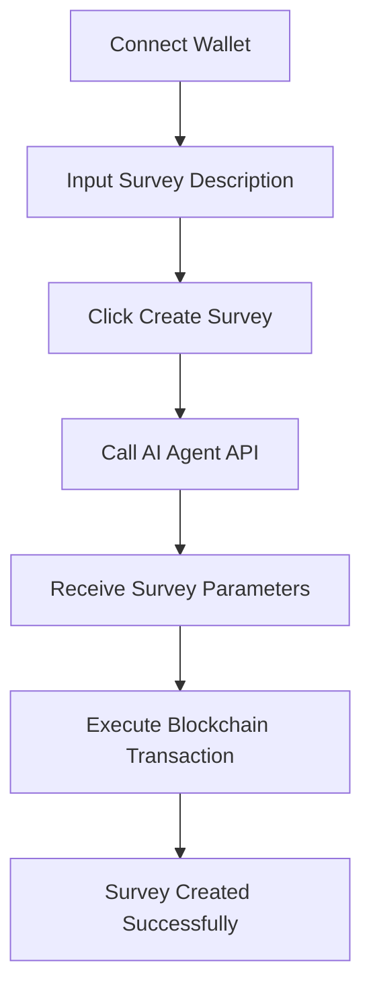

## 1. Product Overview
A web application that enables users to create blockchain-based surveys by connecting their crypto wallet, generating survey parameters through AI, and locking funds on-chain for survey rewards.

Target users: Web3 enthusiasts and survey creators who want to incentivize participation with cryptocurrency rewards.

## 2. Core Features

### 2.1 User Roles
| Role | Registration Method | Core Permissions |
|------|---------------------|------------------|
| Survey Creator | Wallet connection via Thirdweb | Create surveys, lock funds, view survey status |

### 2.2 Feature Module
The survey creation application consists of the following main pages:
1. **Create Survey page**: Wallet connection, survey description input, AI parameter generation, blockchain transaction execution.

### 2.3 Page Details
| Page Name | Module Name | Feature description |
|-----------|-------------|---------------------|
| Create Survey | Wallet Connection | Connect/disconnect crypto wallet using Thirdweb ConnectButton with multiple wallet providers (MetaMask, Coinbase, Rainbow, Rabby, Zerion, in-app wallets). |
| Create Survey | Survey Input | Textarea for users to input survey description and requirements (e.g., "Make a survey about hoodies..."). |
| Create Survey | AI Generation | Send user input and wallet address to AI agent API to generate survey parameters including surveyId, totalReward, and targetResponses. |
| Create Survey | Blockchain Transaction | Execute on-chain survey creation with BNB payment equal to totalReward amount, using Thirdweb v5 contract interaction. |
| Create Survey | Status Display | Real-time status updates showing progress: "Generating AI plan...", "Waiting for transaction...", "Survey created successfully!" |

## 3. Core Process
**Survey Creator Flow:**
1. User connects wallet via Thirdweb ConnectButton
2. User inputs survey description in textarea
3. User clicks "Create Survey" button (disabled if wallet not connected)
4. Application calls AI agent API with user input and wallet address
5. AI returns survey parameters (surveyId, totalReward, targetResponses)
6. Application prepares and executes blockchain transaction with BNB payment
7. Status updates shown throughout the process

## 4. User Interface Design

### 4.1 Design Style
- **Primary Colors**: Blue (#3B82F6) for primary actions, Gray (#6B7280) for secondary elements
- **Button Style**: Rounded corners with hover effects, disabled state for disconnected wallet
- **Font**: Inter or system fonts, 16px base size
- **Layout**: Centered card layout with clean spacing
- **Icons**: Thirdweb wallet icons, loading spinners for async operations

### 4.2 Page Design Overview
| Page Name | Module Name | UI Elements |
|-----------|-------------|-------------|
| Create Survey | Wallet Connection | Centered ConnectButton with wallet provider logos |
| Create Survey | Survey Input | Large textarea with placeholder text, character limit indicator |
| Create Survey | Action Button | Prominent "Create Survey" button with loading state |
| Create Survey | Status Area | Scrollable log area showing transaction progress and errors |

### 4.3 Responsiveness
Desktop-first design with mobile responsiveness. Touch-friendly buttons and form elements for mobile users.