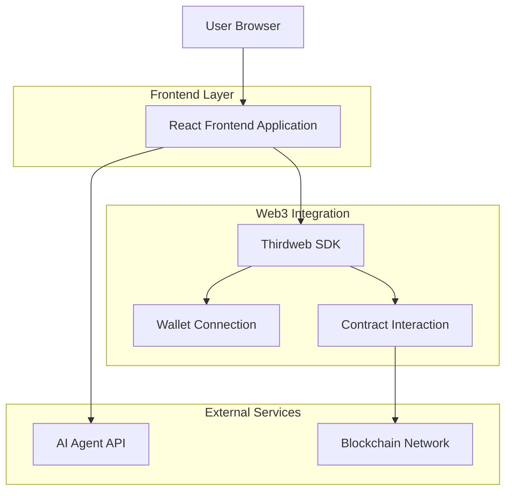

## 1. Architecture design



## 2. Technology Description

* Frontend: React\@18 + Tailwind CSS\@3 + Vite

* Initialization Tool: vite-init

* Web3 Integration: Thirdweb SDK v5

* Backend: None (direct API calls and blockchain interaction)

## 3. Route definitions

| Route | Purpose                                                                 |
| ----- | ----------------------------------------------------------------------- |
| /     | Create Survey page with wallet connection and survey creation interface |

## 4. API definitions

### 4.1 AI Agent API

```
POST https://surveysensei-agent.rahmandana08.workers.dev/agent/create
```

Request:

| Param Name | Param Type | isRequired | Description                              |
| ---------- | ---------- | ---------- | ---------------------------------------- |
| content    | string     | true       | User survey description + wallet address |

Response:

| Param Name | Param Type | Description                                                        |
| ---------- | ---------- | ------------------------------------------------------------------ |
| survey     | object     | Survey parameters including surveyId, totalReward, targetResponses |

Example Request:

```json
{
  "content": "Make a survey about hoodies... Wallet saya: 0x123..."
}
```

Example Response:

```json
{
  "survey": {
    "surveyId": "survey_123",
    "totalReward": "1000000000000000000",
    "targetResponses": 100
  }
}
```

## 5. Thirdweb Integration Details

### 5.1 Wallet Configuration

```javascript
import { createThirdwebClient } from "thirdweb";
import { inAppWallet, createWallet } from "thirdweb/wallets";

export const client = createThirdwebClient({
  clientId: import.meta.env.VITE_TEMPLATE_CLIENT_ID,
});

export const wallets = [
  inAppWallet({
    auth: {
      options: ["google", "discord", "telegram", "farcaster", "email", "x", "passkey", "phone"],
    },
  }),
  createWallet("io.metamask"),
  createWallet("com.coinbase.wallet"),
  createWallet("me.rainbow"),
  createWallet("io.rabby"),
  createWallet("io.zerion.wallet"),
];
```

### 5.2 Contract Interaction

* Contract Address: 0xYourSurveyRewardsAddress (placeholder)

* Function: createSurveyOnChain

* Payment: BNB (native token) equal to totalReward amount

* Required Parameters:

  * \_surveyId (from AI API response)

  * \_creator (user wallet address)

  * \_totalReward (from AI API response, converted to Wei)

  * \_targetResponses (from AI API response)

## 6. Component Architecture

### 6.1 Core React Hooks Usage

* `useActiveAccount()` - Get connected wallet address

* `useSendTransaction()` - Execute blockchain transactions

* `useState()` - Manage form input and status messages

* `useEffect()` - Handle wallet connection state changes

### 6.2 Utility Functions

* `toWei()` - Convert BNB amounts to Wei for blockchain transactions

* Error handling for API calls and blockchain transactions

* Status message management for user feedback

